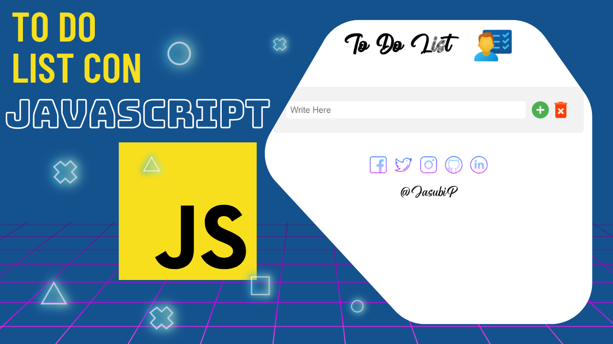

🔥 Soy <strong>Desarrollador JavaScript Front-end </strong> con +2 años de experiencia 👨‍💻

 âš›ï¸ Sitios 🌠Juegos 🮠Aplicaciones 📱

    
    
    
    

 

<h2>Mis mejores proyectos</h2>

<tr>
<td>
    
</td>
<td>
     
</td>
<td>
    
</td>
</tr>